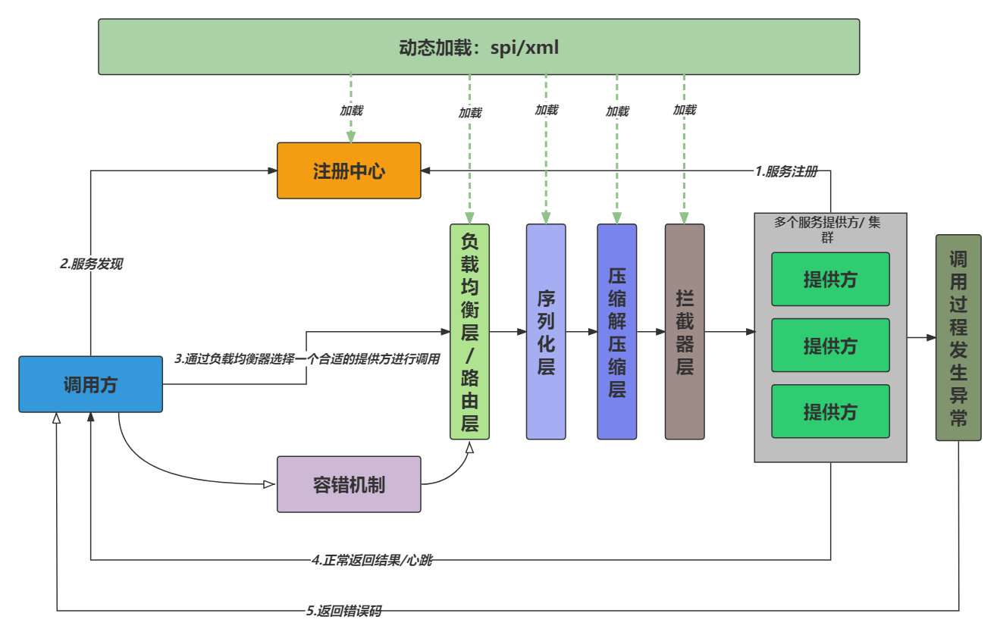
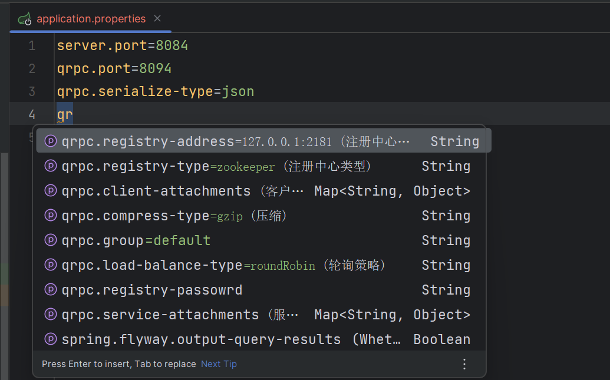
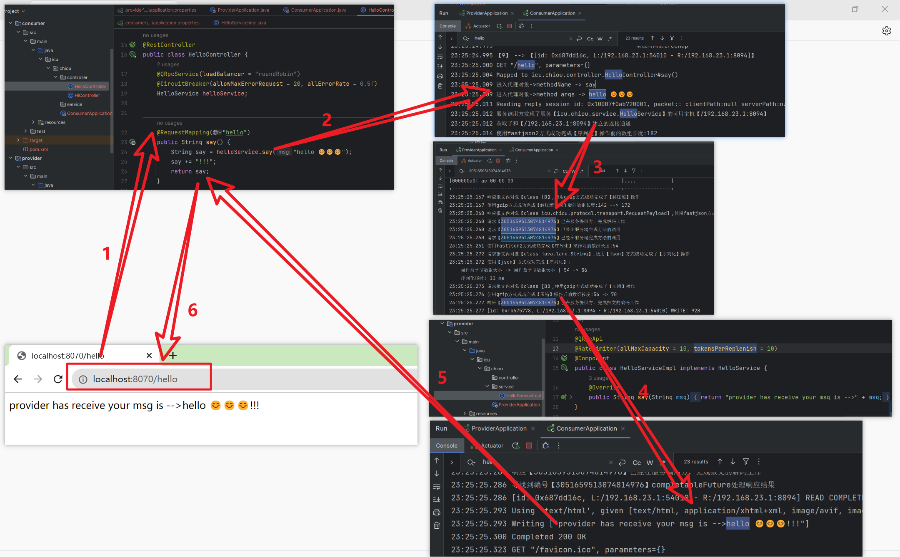

# QPRC

 🚀🚀🚀这是一个手写RPC项目，用于实现远程过程调用（RPC）通信🚀🚀🚀

## 一、项目架构

#### 1、架构和基本流程




#### 2、分层和模块


## 二、功能特性

- **简单的RPC框架的实现**：该RPC框架实现了基本的远程过程调用功能，允许客户端通过网络调用远程服务的方法，实现分布式系统之间的通信和协作。
- **基于Netty的TCP的网络通信基本机制**
  ：RPC框架使用Netty作为底层通信框架，利用Netty提供的异步非阻塞IO特性，为了提高系统的并发处理能力，使用CompletableFuture等方式处理异步请求和结果。通过异步通信，可以在高并发情况下充分利用系统资源，提高性能和吞吐量。
- **服务注册与发现**：通过注册中心-ZooKeeper实现：RPC框架支持服务注册与发现功能，将服务提供者的地址注册到ZooKeeper注册中心，并由客户端从注册中心获取可用的服务提供者列表。
- **多种序列化/反序列化、压缩协议支持**
  ：RPC框架提供多种序列化和反序列化协议的支持，例如JSON、Hessian等，以适应不同场景下的数据传输需求。同时，还支持数据压缩协议，有效减少网络传输的数据量，提高传输效率。
- **多种负载均衡策略的实现**：RPC框架支持负载均衡策略，用于在客户端选择合适的服务提供者。目前支持轮询、最少响应时间等负载均衡策略，可以根据实际情况选择最优的策略。
- **请求超时与重试机制**
  ：为了保证系统的稳定性和性能，在RPC框架中实现了请求超时和重试机制。当请求超过设定的时间未得到响应时，会进行超时处理，避免长时间的等待。同时，也可以设置重试次数，当请求失败时，自动进行重试，提高请求成功率。
- **服务治理能力**：RPC框架支持一定程度的服务治理能力，例如心跳检测器用于定期检测服务提供者的存活性，并维护连接池。此外，还支持服务的动态添加和移除，能够在运行时动态调整服务列表。
  - 限流器：为了保护系统资源，防止过多的请求造成系统过载，RPC框架支持限流器功能。通过限制请求的并发数量或速率，可以有效地控制系统的负载，保持系统的稳定性。

  - 熔断器：当服务提供者出现故障或不可用时，熔断器功能可以避免无效的请求继续发送，而是及时中断对该服务的请求。这样可以减少资源浪费，并保护系统免受故障的影响。
- **整合Spring Boot**：RPC框架可以与Spring Boot进行了集成，方便在SpringBoot项目中使用RPC功能。可以通过自定义注解或配置来注册和使用RPC服务，并将RPC框架与Spring Boot的其他功能无缝结合。
- **基于SPI机制动态加载配置**：通过SPI（Service Provider Interface）机制，用户可以动态加载和配置不同的功能模块，定制化RPC框架的行为。用户还可以自定义实现RPC的SPI，从而扩展和定制框架的功能，实现个性化需求的适配。


## 三、快速开始

#### 1、克隆项目到本地

```bash
https://github.com/red-velet/qrpc.git
```


#### 2、打开项目目录

> 根目录-qrpc

- `qrpc-framework`：最原始的qrpc，没有集成springboot，可以根据项目的commit记录，查看每一步的编写过程，从而实现从零了解编写qrpc的过程记录。
  - `qrpc-core`：核心包，核心代码。
  - `qrpc-common`：常量、枚举、异常、工具类等存放地。
- `qrpc-starter/spring-boot-starter-qrpc`：
  - `qrpc-core`：请单独打开该模块，存放核心代码，如需使用请使用maven进行install，然后导入对应地址即可。
  - `springboot-qrpc-test`：请单独打开该模块，测试模块，两个springboot的web项目用作提供方和调用方。


#### 3、项目配置

1. 本地install后，引入maven坐标：

   ```xml
   <dependency>
       <groupId>icu.chiou</groupId>
       <artifactId>spring-boot-starter-qrpc</artifactId>
       <version>1.0-SNAPSHOT</version>
   </dependency>
   ```

2. 可以修改配置项：在对应springboot的配置文件，如`application.properties`中进行自定义配置：

   ```properties
   server.port=8084
   qrpc.port=8094
   qrpc.serialize-type=json
   ```

   
   
3. 如果需要自行配置，请参考：

   ```java
   // 自行配置spi,用户SPI,文件名:接口名,文件内容:key=value
   private static final String DIY_LOADER = "META-INF/qrpc-diy/";
   
   // 自行配置参数配置文件
   qrpc.service-attachments.
   qrpc.client-attachments.
   ```

   

#### 4、服务开启

注意：

- 如需使用服务，需要在项目启动类上加上`@EnableQRpcProvider`或者 `@EnableQRpcConsumer`
- 提供方和调用方都需要实现第三方的一个接口。
- 具体使用可以参考`qrpc/qrpc-starter/spring-boot-starter-qrpc/springboot-qrpc-test`内的项目模块（需要单独打开）
  - api：双方都实现的一个接口
  - provider：服务提供方
  - comsumer：服务调用方


> **服务提供方开启配置**：

```java
@SpringBootApplication
@EnableQRpcProvider
public class ProviderApplication {
    public static void main(String[] args) {
        SpringApplication.run(ProviderApplication.class, args);
    }
}
```


> **服务调用开启配置**：

```java
@SpringBootApplication
@EnableQRpcConsumer
public class ConsumerApplication {
    public static void main(String[] args) {
        SpringApplication.run(ConsumerApplication.class, args);
    }
}
```


> **服务提供方使用**：

```java
@QRpcApi
@RateLimiter(allMaxCapacity = 10, tokensPerReplenish = 10)
@Component
public class HelloServiceImpl implements HelloService {
    @Override
    public String say(String msg) {
        return "provider has receive your msg is -->" + msg;
    }
}
```


> **服务调用方使用**：

```java
@RestController
public class HelloController {
    @QRpcService(loadBalancer = "roundRobin")
    @CircuitBreaker(allowMaxErrorRequest = 20, allErrorRate = 0.5f)
    HelloService helloService;


    @RequestMapping("hello")
    public String say() {
        say = helloService.say("hello 😊😊😊");
        say += "!!!";
        return say;
    }
}
```


#### 5、效果图




## 四、API文档

 暂无
​ 请参考[API文档](docs/API.md)了解更多关于RPC框架的使用方法与API接口。


## 五、贡献指南

 欢迎提交Issue或Pull Request，感谢您的贡献！😊😊😊


## 六、联系交流

 如果您有任何疑问或建议，请发送邮件至bluebeastmight@gmail.com。

 个人博客: www.chiou.icu


## 七、Star History

<a href="https://star-history.com/#red-velet/qrpc&Date">

  <picture>
    <source media="(prefers-color-scheme: dark)" srcset="https://api.star-history.com/svg?repos=red-velet/qrpc&type=Date&theme=dark" />
    <source media="(prefers-color-scheme: light)" srcset="https://api.star-history.com/svg?repos=red-velet/qrpc&type=Date" />
    
  </picture>
</a>
